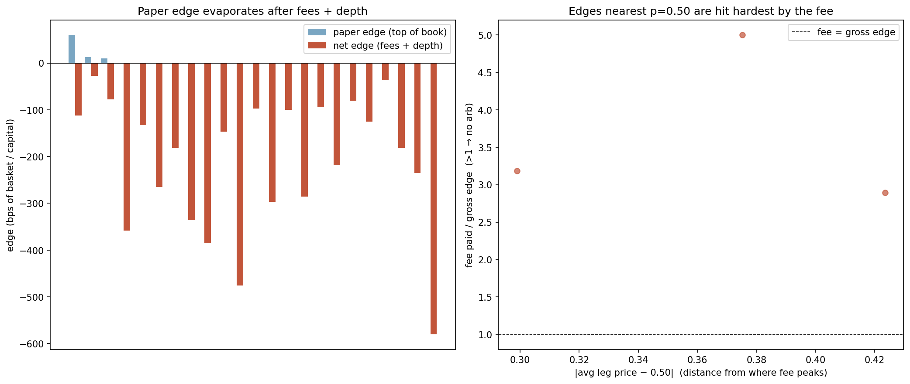
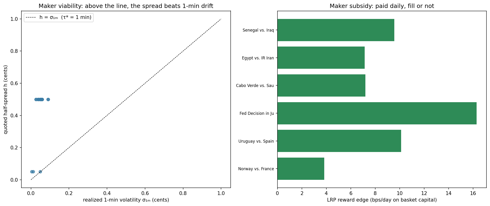

# pmarket-arb

I kept seeing people claim there's free money in Polymarket's multi-outcome
markets: the prices of all the outcomes don't always add up to 1, so surely you
can buy the cheap side and lock in a profit? I wanted to know if that's actually
true once you trade against the real order book and pay real costs. It mostly
isn't, and working out *why* led somewhere more interesting than the arb itself.

This repo is the tool I used to check. It has two commands: `scan` looks for the
textbook arbitrage and shows you what's left of it after fees and depth, and
`maker` looks at the other side of the same market — providing liquidity — which
is where the edge turns out to actually live.

## The market structure

A Polymarket "negRisk" event is something like *Who wins the group?* or *Fed
decision in July?*. Under the hood it's N separate yes/no markets that share an
ID, with one guarantee enforced on-chain: exactly one of them resolves Yes. That
single fact means the prices have to obey

```
price(Yes_1) + price(Yes_2) + ... + price(Yes_N) = 1
```

If they don't, there's in principle a riskless trade:

| When | Trade | Payout |
|---|---|---|
| Yes side is too cheap (asks sum < 1) | buy one Yes on every outcome | exactly one pays $1, so the basket returns $1 |
| Yes side is too rich (No asks sum < N−1) | buy one No on every outcome, then call the negRisk adapter's `convertPositions` | the No-set redeems on-chain for (N−1) dollars, instantly and gasless |

`scan` checks both directions against live order books.

## What I found: the arbitrage doesn't survive the fee

Polymarket only charges takers (people who cross the spread). The fee is

```
fee = shares × feeRate × p × (1 − p)
```

where `p` is the price you trade at. I checked this against Polymarket's own
published example and it matches. The thing to notice is the `p × (1 − p)` term:
it's biggest at `p = 0.50`, which is exactly where these little pricing gaps tend
to show up. So the fee is largest in precisely the spot where the supposed edge
appears.

Here's a real one from a live scan, the *Fed Decision in July?* event, No side:

```
basket of No asks = 3.995   (it would need to be < 4.000 to be an arb)
best size you can actually fill = 29,893 shares per leg
gross profit  = +$149.47
taker fee     =  $475.93     the fee alone is over 3× the gross
net profit    = −$326.47
```

The gap is genuinely there. It's just smaller than what it costs to grab it. In
the run I saved, of 12 liquid events, one had a positive edge at the top of the
book and none were still profitable after costs.



*Left: the tiny top-of-book "edge" (blue) next to what's left after fees and
depth (red). Right: the closer a basket trades to 0.50, the more the fee swamps
the gross — everything above the dashed line is a losing trade.*

One detail that matters: this isn't a top-of-book screener. To know the *real*
edge you have to fill size, and filling size walks you up the book into worse
prices. So for each event the scanner simulates the actual fills level by level,
charges the fee at each fill's price, and searches for the trade size that leaves
the most money on the table after costs (often that's a small size, or zero). The
number it reports is the gap between the edge on paper and the edge you could
actually capture.

## Where the edge actually is: making, not taking

The same fee schedule that kills the taker trade pays makers nothing and even
subsidises them. So the better question is whether *providing* liquidity around
these markets pays. The `maker` command looks at that, and I deliberately built
it on measured quantities rather than a made-up fill simulator. Three pieces:

**Is the spread wide enough?** If you post a quote and the price doesn't move
before someone trades with you, you earn the half-spread `h`. If the price drifts
while you wait, you lose roughly `σ·√τ`, where `τ` is how long your quote sits and
`σ` is volatility. Setting those equal gives a breakeven waiting time
`τ* = (h / σ)²`. I measure `σ` from real per-minute price history, so this needs
no assumptions about fill rates: you make money if your quotes fill faster than
`τ*`. On the liquid markets I looked at, `τ*` came out to one to six hours, so the
spread is comfortably wide enough for a patient quoter.

**The reward subsidy.** Polymarket runs a daily reward pool per market for people
who quote tight, two-sided size. Reading the real pool numbers and modelling your
cut as your share of the qualifying depth, this adds a few to ~15 bps per day on
the capital you put up. It's real money, but the model also shows most of it gets
competed away right at the touch.

**The part that's specific to these markets.** If you quote all N outcomes and
end up holding one share of each, you own something that pays exactly $1 no matter
who wins — a synthetic risk-free bond. The risk of getting stuck with inventory,
which is the thing that usually scares a market maker, nets to zero at resolution
across the full set. Someone quoting a single yes/no market can't do that. That
asymmetry is the actual structural advantage here.



*Left: every market's quoted half-spread (y) sits above its measured 1-minute
volatility (x), so the spread beats the drift. Right: the reward subsidy per
event in bps/day.*

## Running it

```bash
pip install -r requirements.txt

# the taker arb, net of fees and depth
python main.py scan --min-volume 150000 --detail --plot docs/fee_drag.png

# the maker side: breakeven waiting time, rewards, inventory netting
python main.py maker --min-volume 200000 --max-events 6 --detail --plot docs/maker_edge.png

# snapshot the books over time, then see how often/large the edges really were
python main.py record --file snaps.jsonl --iterations 60 --interval 60
python main.py replay --file snaps.jsonl
```

Saved example output: [`docs/example_scan.txt`](docs/example_scan.txt) and
[`docs/example_maker.txt`](docs/example_maker.txt).

## Things I'd want a reviewer to know

- The numbers above are a snapshot from June 2026. Re-run it and you'll get
  different markets; the conclusions have held every time I've looked, but I'm
  not claiming they're eternal.
- Prices and depth come from Polymarket's CLOB (the real book). The Gamma API is
  only used to find the events and read their fee and reward settings.
- `scan` is a point-in-time analyzer. A real arbitrage needs N fills at once, and
  the price can move between them — I don't model that, but it only makes the
  edge smaller, not bigger. There's no order execution in here.
- The maker model simplifies in ways I know about: it rolls adverse selection
  into one volatility term and can't tell informed flow from noise; it assumes
  the reward pool splits in proportion to size (Polymarket's real formula favours
  tighter quotes more than that); and the "risk-free bond" netting is exact only
  at resolution — intraday the legs move together but not perfectly. The honest
  next step is a fill-level backtest off the trade feed; the breakeven and
  netting results don't need one.

## Tests

```bash
python -m pytest     # 23 tests
```

They cover the fee formula (against Polymarket's worked example), the
book-walking and fill logic, the optimal-size search, the case where fees kill a
real gross edge, the convert side, the volatility math, the reward split, the
breakeven calculation, and the basket netting.

## Layout

```
pmarket_arb/
  fees.py           taker fee: shares × rate × p × (1−p), parsed per market
  orderbook.py      order book + walking it to fill a given size
  markets.py        the negRisk event / outcome data model
  gamma.py          find and parse negRisk events (Gamma API)
  clob.py           pull live order books in batch (CLOB API)
  dutchbook.py      the taker arbitrage scanner, both directions
  microstructure.py realized volatility from real price history
  rewards.py        the liquidity reward pool model
  maker.py          maker edge: breakeven waiting time + inventory netting
  report.py         the tables and charts
  backtest.py       record book snapshots, replay them into stats
  cli.py            scan / maker / record / replay
tests/
```
